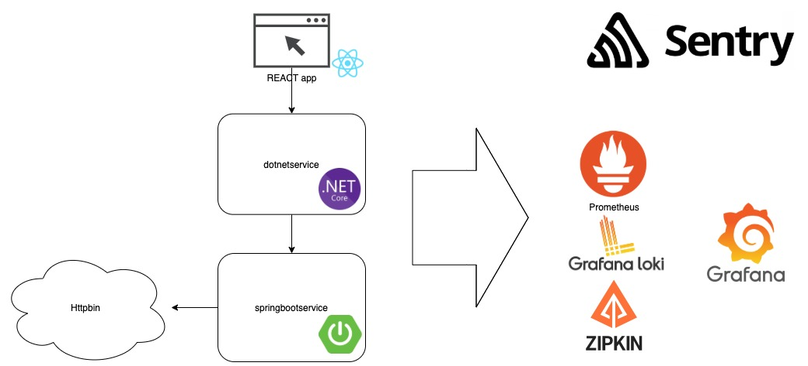
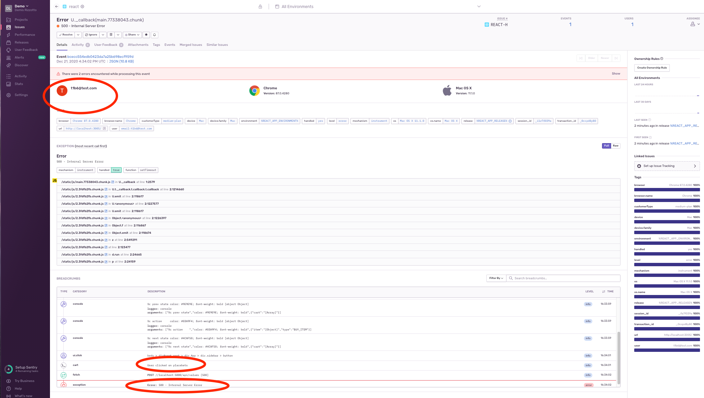
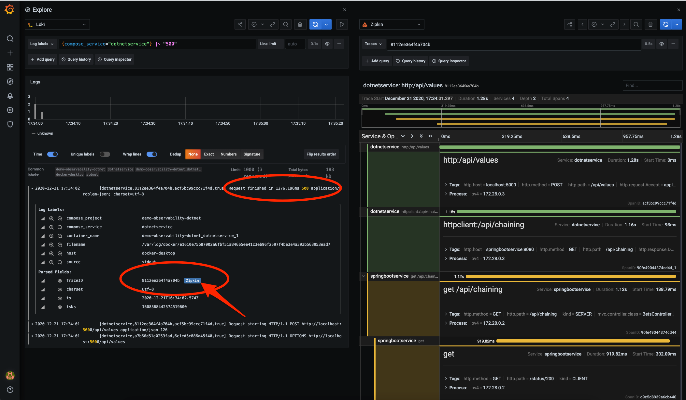

# Observability demo

Demo of observability capabilities with different frameworks (React, .NET core, Spring Boot).



## Run

`docker-compose up -d --build`


For build and run reac without docker :
```
cd react/ 
npm run deploy
```

# URLs:

- dotnetservice :
  - http://localhost:5000/api/values
  - actuator
      - http://localhost:5000/actuator/health
      - http://localhost:5000/actuator/info
      - http://localhost:5000/actuator/prometheus

- Prometheus : http://localhost:9090
- Grafana : http://localhost:3000 (user: admin / pass: secret) 
- Zipkin: http://localhost:9411/zipkin/?serviceName=dotnetservice
- Sentry: https://sentry.io/organizations/demo-lm/issues/?project=5563890
- React : http://localhost:3005
- SpringBoot : http://localhost:8080/api/bets

# Setup

## Setup logs Docker to Loki

```
docker plugin install grafana/loki-docker-driver:latest --alias loki --grant-all-permissions
docker plugin ls
docker plugin enable loki
```

### Configure
https://github.com/grafana/loki/blob/master/docs/clients/docker-driver/configuration.md

specify driver in docker-compose service 
```yaml
    logging:
      driver: loki
      options:
        loki-url: "http://localhost:3100/loki/api/v1/push"
```

### To remove

```
docker plugin disable loki
docker plugin rm loki
```

---

# Test

Got to react front http://localhost:3005
Cool! We can bet on our favorite footbal team.

`...Something went wrong`

😕 It seems that sometimes bets don't work.


Developers should try to fix the bug. 
But how can they know where search?
They only know that "sometimes" doesn't work.

🚀 The power of observabily tools help them

They start from [Sentry](https://sentry.io/organizations/demo-lm/issues/?project=5563890) and found the user issue.
They found an error when the user bet and the betting system respond to the call with an error code 500.



Ok, maybe we can start checking if the services are up. (the monitoring system should do it, but we can grab some informations)
- http://localhost:5000/actuator/health
- http://localhost:8080/actuator/health

We can check metrics : http://localhost:3000/d/Sleb_VEiz/jvm-micrometer?orgId=1&refresh=30s&from=now-5m&to=now

Now look in the logs with [Loki](http://localhost:3000/explore?orgId=1&left=%5B%22now-15m%22,%22now%22,%22Loki%22,%7B%22expr%22:%22%7Bcompose_service%3D%5C%22dotnetservice%5C%22%7D%20%7C~%20%5C%22500%5C%22%22%7D%5D)
and serach code 500 : `{compose_service="dotnetservice"} |~ "500"`
Click on the log and open the trace (bug : wrong order of span. Open trace in [Zipkin interface](http://localhost:9411/zipkin))



You can also search ol logs based on trace id `{compose_project="demo-observability-dotnet"} |~ "a9e4f7df437b094f"`

# To fix

dotnetservice:
- add errors logs when receive stauts code 500
- http metrics not exported when we enable tracing

tracing:
- wrong order of span displayed by grafana. Search if it's a Grafana bug or other.

/!\ Currently Steeltoe use opentelemetry version:0.2.0-alpha .
opentelemetry it's currently in 1.0.0.RC1 so, should be released soon an probably upgraded in Steeltoe too. 
